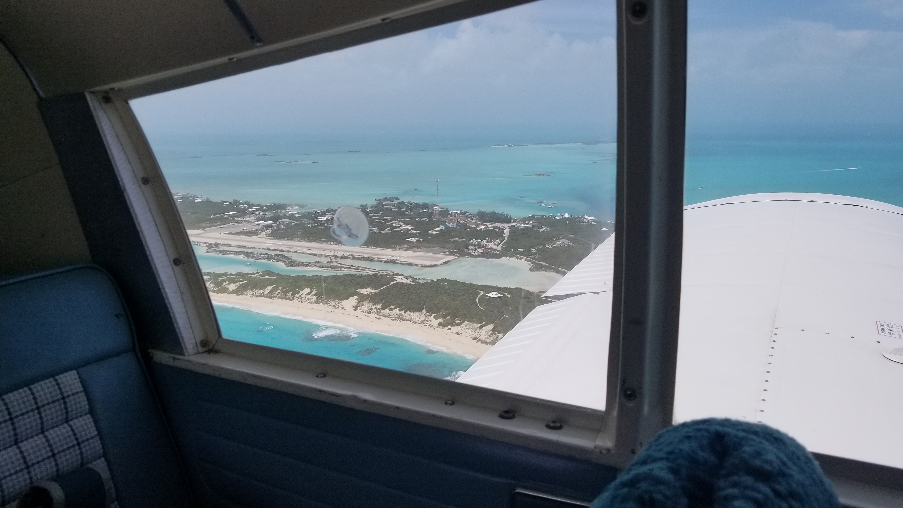
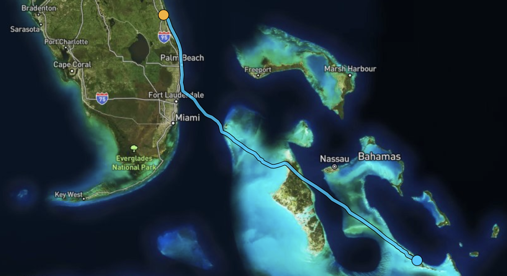
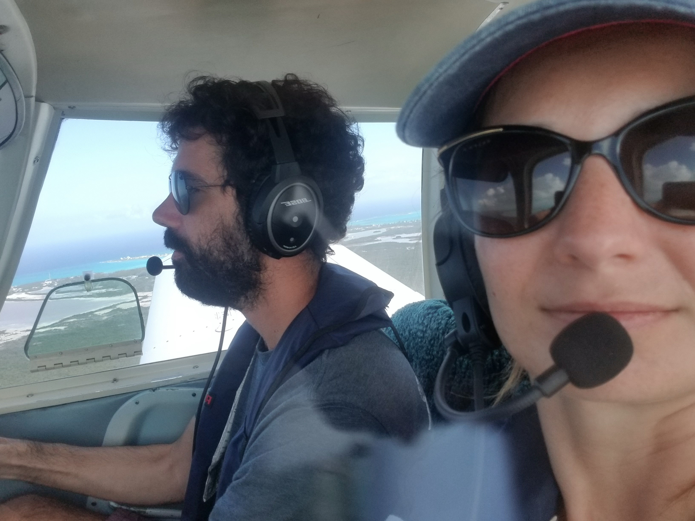
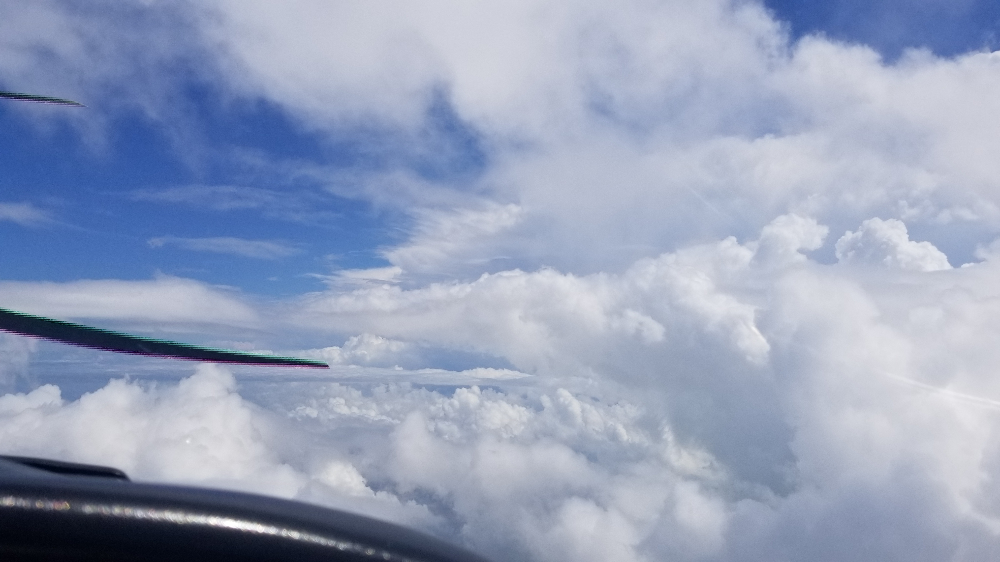
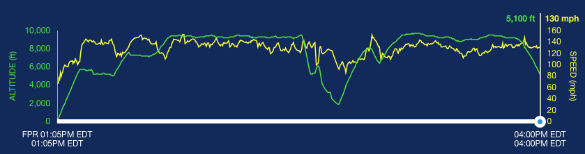
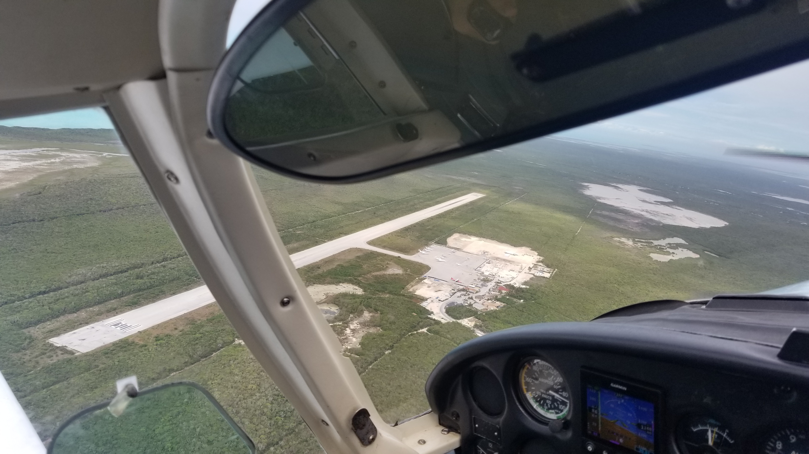

# Flying to the Bahamas

If you're flying in Florida then the thought of taking a trip out to the Bahamas has to have crossed your mind. Maybe you sketched the trip out in ForeFlight a couple times but you figured the planning and paperwork overhead would be too much. I'm writing this up to encourage you to pull the trigger and do it! There is definitely some planning involved, but I'm a fairly low hour VFR pilot with decidedly room-for-improvement planning abilities, if I can manage the planning then you definitely can.

### Choosing a Route

First up is to pick a destination. Me and my wife Claire wanted to go somewhere a bit wild and less developed than Nasssau and after talking a bit with very experience island flyer [Galin Hernandez](http://www.puertoricoflyer.com/), we settled on heading to the Exumas. We would land at Exuma International (MYEF) and get a hotel there for the long weekend, and then fly up the Exumas for a day trip to [Staniel Cay](https://stanielcay.com/activities/) to rent a boat and see the swimming pigs and the Thunderball Grotto.

Leaving from St Augustine's KSGJ in N4886L, we couldn't fly direct to Exuma, so we stopped at Fort Pierce (KFPR) to top off the tanks and get some lunch before the long leg out to MYEF. Thanks again to Galin for recommending KFPR and the Airport Tiki!

This was my first time flying out of glide distance of land for a meaningful amount of time. Even though the water looks beautiful I definitely wanted to limit the amount of time that an engine out scenario would require swimming, so we flew along the coast until just North of the Miami Bravo and turned on course for Bimini at around 9500 feet to reduce the amount of time that we would be beyond glide distance to land. Once past there we would fly over the northern edge of [Andros](https://en.wikipedia.org/wiki/Andros,_Bahamas), a large but sparsely populated archipelago with some really cool looking terrain. After Andros we would fly down the Exumas never too far from a little sandbar or small island. 

(For any data nerds, the KML track is [here](./KFPR_MYEF.kml))

### Equipment/Paperwork/Customs/Procedures!

The Bahamas has a helpful [GA guide](https://www.bahamas.com/getting-here/private-aviation/pilot-faqs) which covers the required papers and procedural requirements of flying a GA plane to the islands. You can do a lot of the paperwork ahead of time to reduce task load the day of the flight, but here are some recommendations on top of that having just gone through it.

#### Emergency Gear & the Plane

Lifejackets are required! Not only that, they're good for your health in the event of emergency. Galin was kind enough to lend us his inflatable emergency life jackets for the journey, but I've also heard that you can rent them at Ft Pierce. You can also rent emergency rafts there. I have heard arguments for and against life rafts for this trip, we opted to just rely on the life jackets, reasoning that there is plenty of boat traffic in the area to ditch in front of in the event of engine failure. Relatedly, [marine radios](https://www.westmarine.com/handheld-vhf-radios) are also a good idea. If your plane unexpectedly becomes a submarine then you will likely be hoping for a boat to rescue you rather than a plane, so having a marine radio set to channel 16 would help you out with that.

The plane also needs a customs sticker. If you're flying with a NEFLAC club plane, that's already taken care of, but you'll still need the decal number for eAPIS so grab a photo. If you're flying your own plane you need to get a customs decal from CBP and they're good for one year.

#### Use an FBO

We called [Odyssey Aviation](https://www.odysseyaviation.com/) at Exuma and asked them to help with immigration and customs. They arranged for a customs officer to be at the airport when we landed and helped us with all the paperwork, got us a cab, and helped with picking a hotel all for about $50. For the logistically challenged (like myself) this is well worth the money. They will prepare your Bahamas immigration card and your [Cruising Permit](https://e291f1206726d700191b-d0cedd1cc05016668dc83bc2742129e5.ssl.cf1.rackcdn.com/windsong/media/bahamas_customs_form_c7a-5f6df60faf8b8.pdf) which you will need if you want to make flights within the Bahamas while you're there.

#### Health Visa

While COVID is in the rear view mirror as far as the US is concerned domestically, the Bahamas is still being fairly vigilant. Part of this requires that you fill out the [Bahamian Health Visa](https://travel.gov.bs/). The full matrix is available on their site, but broadly: if you're vaccinated you need a negative rapid antigen test within 3 days of arrival, if you're unvaccinated then you need a negative PCR test from within 3 days of arrival. I didn't see anywhere that explicitly prohibits self-administered tests, but the forms clearly expect something like a doctor's office or a CVS.

#### eAPIS

[eAPIS](https://eapis.cbp.dhs.gov/auth/login.html) is the Electronic Advance Passenger Information System. Basically you need to fill out a manifest for each flight you do for crossing the border, and you need to file it at least one hour before departure (here's some other [FAQs](https://www.aopa.org/travel/international-travel/eapis-frequently-asked-questions)). I filed ours the night before each flight so we were pretty sure about our plans but we didn't need to worry about it the day of flight. Note that this requirement is _per flight_, so you'll need to file one for the trip out, and one for the trip back. It's a pretty standard web form but you will need passport numbers and DOBs for anyone traveling with you so it's not a bad idea to have them around or available by phone while you're filling it out.

#### Flight Plan

You must file a flight plan before leaving or entering US airspace. I just used ForeFlight for the way out and it was extremely straightforward, just don't forget to _activate_ the flight plan, I asked Claire to remind me of it at the run up so we had two chances to remember. On the way back ForeFlight didn't want to file a VFR flight plan from the Bahamas so I just filed it in the air with Nassau radio on 128.00 once we took off (this may have been user error on my part and not ForeFlight's fault).

One thing you might notice while planning your flight is that there aren't METARs or TAFs reported by most (any?) Bahamas airports so you end up relying on MOS for planning. Once you're talking with Exuma tower they'll read you the weather over the radio, and in the untowered airports you're going to have to rely on spotting a wind sock. 

Luckily the weather in the Bahamas tends to be really nice. It can be a bit windy (during our trip it was usually 15-20kts) and many airports there are only one runway, and that runway heading is often dictated more by the shape of the island than the prevailing wind direction. All this together means that you might be getting some good crosswind landing practice.

#### Preparing for Flying Back

After hanging out in the islands you might at some point successfully fight the urge to just stay there forever. This means you'll be flying back across the border and so you have to do many of the same things but in reverse. For the US you need to have a negative COVID test (although no one asked for ours on our return), you have to file a eAPIS arrival, and file a flight plan. 

One other thing that the Bahamas website says is "call and advise U.S. Customs of your ETA via landline and get “code” from Custom Officer". If you are flying into _Ft Pierce specifically_, this appears to be unnecessary. In fact they weren't answering their phones for a while when we were attempting to depart so we were a bit delayed by trying to follow this instruction. When I got someone on the phone they just said Ft Pierce doesn't do that, eAPIS is good enough, and you just show up roughly when your eAPIS arrival filing indicates.

### The Fun Part: Flying!

So after all this planning we went out to the hangar at KSGJ at around 0800. I had fueled the plane up the previous night so we just had to load in our luggage, preflight the plane, and we were good to go. I was pretty sure I did all the paperwork right (spoiler: I did!) but I kept worrying I had forgotten something so I was happy to have the more pressing and straightforward concern of just flying the plane.

There was no traffic on the ground and we were in the air by 9:05, just after our intended departure time. We had intended to cruise at around 5,500 on the way down to KFPR but there was a pretty thick cloud layer around 4000 feet until around Melbourne, so we flew low along the coast and picked up flight following and arrived into KFPR at 10:40 and taxied over to the Airport Tiki. This was only the third time Claire had been flying with me but she had learned how to use ForeFlight and set the radio frequencies, I cannot overstate how helpful it was for me and I think it made the trip more interesting for her.

We had a pretty solid lunch at the Airport Tiki, though we sadly didn't arrive in time for breakfast. Next time we'll depart earlier! APP topped off our tanks, I called customs to check if we needed permission to depart (we did not), and off we went!

At the runup we activated our flight plan that we had filed at lunch and took off down the coast and picked up flight following. The weather had cleared up a bit so we were able to climb up to our target of 9,500 before we neared the northern edge of the Miami Bravo. After that we turned on course for Bimini and had a very pleasant trip through the ADIZ. Some resources say to explicitly get permission to go through the ADIZ but the controller for Miami who we were with on flight following sounded a bit confused when I asked and said I was already set, so it seems like if you have a squawk code and a filed flight plan and eAPIS then you're good.

As we passed Bimini we celebrated making it past the major over-water leg, and immediately realized we had forgotten to put on our life jackets before the flight. A few awkward minutes of getting them from the back seat and figuring out how to put them on mid-flight and we were in better shape. In retrospect we should have made this a checklist item at the runup along with opening the flight plan, or better yet, put them on before getting in the plane. I've heard it said that equipment you wear is survival gear, equipment in the back of the plane is camping gear and it seems sensible enough a guideline to follow.

The views were spectacular and the flight was going great. As we approached Andros I noticed that the clouds were getting significantly higher and started to realize that we couldn't fly over them, and being a VFR pilot I could not fly through them.

As I started maneuvering to maintain sufficient VFR cloud separation we ended up having to descend pretty low and adjust our course making this part of the journey pretty evident on the [FlightAware](https://flightaware.com/live/flight/N4886L/history/20220414/1730Z/KFPR/L%2023.93568%20-76.44597) altitude/speed chart!

It turns out that in the islands clouds like to sit above land during the day, and at night the sky around land tends to clear up while clouds propagate over the water. If you're a VFR pilot take into account that flying directly over Andros might not be feasible depending on how the clouds are that day even if the rest of the trip is totally clear.

After passing Andros we hardly saw another cloud as we approached Exuma. I called the tower about 10 miles out to request landing and weather. We were in luck and the wind was basically right down the runway at a decent 15 knots. One thing to consider when landing here is that there is only one taxiway that leads off the runway and it is basically in the middle of this 7,000 foot runway. If you make a nice clean landing right by the numbers you're going to be taxiing on and occupying the runway for a while, so maybe land a bit later if your plane doesn't need that much runway. I thought of this too late on my first landing so I just didn't use brakes and tried to hustle as fast as was safe to the exit.

